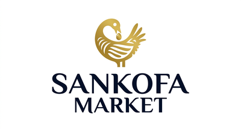

# SANKOFA MARKET GHANA
## Your Complete Guide to Ghana's Premier Online Marketplace

**Document Reference:** SM-USER-GUIDE-001  
**Version:** 1.0  
**Date:** January 2026  
**Classification:** Public

---

<div class="letterhead">
<div class="letterhead-container">
<div class="letterhead-left">

<div class="letterhead-text">
<h1 class="letterhead-title">Sankofa Market Ghana</h1>
<p class="letterhead-subtitle">Ghana's Premier Online Marketplace</p>
<p class="letterhead-tagline">Connecting Buyers and Sellers Across Ghana</p>
</div>
</div>
<div class="letterhead-right">
<div class="letterhead-contact">
<div class="letterhead-contact-item">
<i class="fas fa-globe"></i>
<a href="https://sankofamarket.com.gh">sankofamarket.com.gh</a>
</div>
<div class="letterhead-contact-item">
<i class="fas fa-envelope"></i>
<a href="mailto:info@sankofamarket.com.gh">info@sankofamarket.com.gh</a>
</div>
<div class="letterhead-contact-item">
<i class="fas fa-phone"></i>
<span>+233 XX XXX XXXX</span>
</div>
<div class="letterhead-contact-item">
<i class="fas fa-map-marker-alt"></i>
<span>Accra, Ghana</span>
</div>
</div>
</div>
</div>
</div>

<div class="ghana-accent"></div>

---

## WELCOME TO SANKOFA MARKET GHANA

### 🇬🇭 Ghana's Trusted Online Marketplace

Sankofa Market Ghana is more than just an online marketplace—it's a revolution in how Ghanaians buy and sell. Built specifically for the Ghanaian market, we connect buyers and sellers across all 16 regions of Ghana with safety, convenience, and trust at our core.

The name "Sankofa" comes from the Akan language, meaning "to go back and fetch it." It symbolizes learning from the past while building for the future—reflecting our commitment to creating a modern marketplace that respects traditional Ghanaian values of community, trust, and fair trade.

---

## 🌟 WHY CHOOSE SANKOFA MARKET?

### For Buyers

#### ✅ Verified Sellers
Every seller on our platform is verified using their Ghana Card, ensuring you're dealing with real, trustworthy people. No more worrying about scammers or fake sellers.

#### ✅ Escrow Protection
Your money is safe with us. When you make a purchase, your payment is held securely in escrow until you receive and confirm your order. If there's a problem, we've got your back.

#### ✅ Mobile Money Integration
Pay the way you prefer. We support MTN Mobile Money, Vodafone Cash, AirtelTigo Money, and credit/debit cards. No need for bank accounts or complicated payment methods.

#### ✅ Wide Selection
From electronics and fashion to vehicles and real estate, find everything you need in one place. Over 14 categories with thousands of products from sellers across Ghana.

#### ✅ Buyer Protection
Our comprehensive buyer protection policy ensures you're covered. If something goes wrong, our dispute resolution team will help you get a fair outcome.

#### ✅ Easy Returns
Not satisfied with your purchase? Our clear return policy makes it easy to return items and get your money back.

#### ✅ Reviews and Ratings
Make informed decisions with honest reviews and ratings from other buyers. See what others think before you buy.

#### ✅ 24/7 Support
Our customer support team and AI chatbot are available 24/7 to help you with any questions or issues.

### For Sellers

#### ✅ Reach Millions
Access millions of potential buyers across Ghana. No longer limited to your local area—sell to customers in Accra, Kumasi, Tamale, and everywhere in between.

#### ✅ Easy Listing
Create professional product listings in minutes. Upload photos, write descriptions, set your price, and start selling. It's that simple.

#### ✅ Secure Payments
Get paid securely through our escrow system. No more worrying about payment fraud or chargebacks. Your money is protected.

#### ✅ Low Fees
Our competitive fee structure means you keep more of your profits. Only 5% commission on successful sales, with no hidden fees.

#### ✅ Seller Dashboard
Manage your business with our powerful seller dashboard. Track sales, manage inventory, communicate with buyers, and analyze your performance all in one place.

#### ✅ Marketing Tools
Promote your products with our built-in marketing tools. Featured listings, promotional banners, and targeted advertising help you reach more buyers.

#### ✅ Analytics and Insights
Understand your business with detailed analytics. See which products are selling, track your revenue, and make data-driven decisions.

#### ✅ Seller Support
Get the help you need with our dedicated seller support team. From listing optimization to dispute resolution, we're here to help you succeed.

---

## 🎯 KEY FEATURES

### 🛒 Shopping Features

#### Smart Search
Find exactly what you're looking for with our intelligent search engine. Use keywords, filters, and even image search to discover products.

**How to Use:**
1. Type what you're looking for in the search bar
2. Use filters to narrow down results (price, location, condition, etc.)
3. Try image search: upload a photo to find similar products
4. Save your searches for quick access later

#### Advanced Filters
Narrow down your search with powerful filters:
- **Category:** Browse by product category
- **Price Range:** Set minimum and maximum prices
- **Location:** Find products near you
- **Condition:** New, Like New, Good, or Fair
- **Delivery Options:** Free delivery, paid delivery, or pickup only
- **Seller Rating:** Filter by seller ratings
- **Sankofa Store:** Show only official Sankofa Store products

#### Product Comparison
Compare multiple products side-by-side to make the best choice. Compare prices, features, seller ratings, and more.

#### Wishlist and Favorites
Save products you love for later. Add items to your wishlist and access them anytime from any device.

#### Shopping Cart
Add multiple items to your cart and checkout all at once. Review your order, apply discounts, and complete your purchase in just a few clicks.

### 💳 Payment Features

#### Multiple Payment Methods
Pay the way you want:
- **Mobile Money:** MTN, Vodafone, AirtelTigo
- **Credit/Debit Cards:** Visa, Mastercard
- **Bank Transfer:** Direct bank transfers

#### Escrow Protection
Your payment is held securely until you confirm delivery:
1. You make a payment
2. Money is held in escrow
3. Seller ships your order
4. You receive and inspect your order
5. You confirm delivery
6. Payment is released to seller

#### Secure Transactions
All transactions are encrypted and secure. We use industry-standard security measures to protect your financial information.

#### Payment Tracking
Track your payment status in real-time. Know exactly where your money is and when it will be released.

### 🚚 Delivery Features

#### Multiple Delivery Options
Choose the delivery method that works for you:
- **Free Delivery:** Seller provides free delivery
- **Paid Delivery:** Pay for delivery service
- **Pickup Only:** Pick up from seller's location

#### Delivery Tracking
Track your order from shipment to delivery. Get real-time updates on your order status.

#### Delivery Confirmation
Confirm delivery when you receive your order. This releases payment to the seller and completes the transaction.

#### Dispute Resolution
If there's a problem with your delivery, our dispute resolution team will help you find a fair solution.

### 👥 User Features

#### User Profiles
Create your personal profile with your photo, bio, and contact information. Build your reputation with ratings and reviews.

#### Ghana Card Verification
Verify your identity with your Ghana Card for added trust and security. Verified users get a special badge on their profile.

#### Messaging System
Communicate directly with buyers and sellers through our secure messaging system. Ask questions, negotiate prices, and coordinate deliveries.

#### Order History
View all your past orders in one place. Track order status, view details, and reorder with just a few clicks.

#### Notifications
Stay informed with real-time notifications. Get alerts for new messages, order updates, and promotional offers.

### 🏪 Sankofa Store

#### Official Store
Shop with confidence at the official Sankofa Store. All products are verified, quality-checked, and backed by our guarantee.

#### Premium Products
Find premium products from trusted brands. Electronics, fashion, home goods, and more—all in one place.

#### Fast Delivery
Enjoy fast, reliable delivery on all Sankofa Store products. Most orders delivered within 24-48 hours.

#### Easy Returns
Hassle-free returns on all Sankofa Store products. Not satisfied? Return it within 7 days for a full refund.

### 🤖 AI-Powered Features

#### AI Chatbot
Get instant help from our AI chatbot, available 24/7. Ask questions, get recommendations, and resolve issues quickly.

**What the Chatbot Can Do:**
- Answer frequently asked questions
- Help you find products
- Track your orders
- Resolve common issues
- Connect you with human support when needed

#### Image Search
Find products by uploading a photo. Our AI analyzes the image and finds similar products on our platform.

**How to Use Image Search:**
1. Click the camera icon in the search bar
2. Upload a photo or take a new one
3. Our AI finds similar products
4. Browse and shop the results

#### Smart Recommendations
Get personalized product recommendations based on your browsing history and preferences. Discover products you'll love.

### 🔒 Security Features

#### Ghana Card Verification
All users are verified using their Ghana Card, ensuring real people and reducing fraud.

#### Escrow Protection
Your money is protected with our escrow system. Payment is only released when you confirm delivery.

#### Secure Payments
All payments are encrypted and processed through secure, trusted payment providers.

#### Fraud Detection
Our advanced fraud detection system monitors all transactions and flags suspicious activity.

#### Data Protection
Your personal information is protected with industry-standard security measures. We comply with Ghana's Data Protection Act.

#### Two-Factor Authentication
Add an extra layer of security to your account with two-factor authentication.

### 📱 Mobile Features

#### Responsive Design
Our platform works perfectly on all devices—desktop, tablet, and mobile. Shop and sell from anywhere.

#### Mobile-Optimized
Enjoy a seamless mobile experience with our mobile-optimized interface. Fast, intuitive, and easy to use.

#### Push Notifications
Get instant notifications on your mobile device. Never miss a message, order update, or promotional offer.

#### Mobile Payments
Make payments easily from your mobile device using Mobile Money or mobile card payments.

---

## 🗺️ HOW TO NAVIGATE SANKOFA MARKET

### Getting Started

#### Step 1: Create an Account
1. Click "Sign Up" in the top right corner
2. Enter your details (name, email, phone)
3. Verify your Ghana Card
4. Complete your profile
5. Start shopping or selling!

#### Step 2: Verify Your Identity
1. Go to your profile settings
2. Click "Verify Identity"
3. Enter your Ghana Card number
4. Upload a photo of your Ghana Card
5. Wait for verification (usually within 24 hours)

#### Step 3: Set Up Your Profile
1. Add a profile photo
2. Write a bio
3. Add your location
4. Set your preferences
5. Save your changes

### For Buyers: How to Shop

#### Browsing Products
1. **Homepage:** Start at the homepage to see featured products and promotions
2. **Categories:** Browse by category using the category menu
3. **Search:** Use the search bar to find specific products
4. **Filters:** Use filters to narrow down your search
5. **Sort:** Sort results by price, rating, or date

#### Viewing Product Details
1. Click on a product to view details
2. Read the product description
3. Check the seller's rating and reviews
4. View all product photos
5. Check delivery options and costs

#### Adding to Cart
1. Click "Add to Cart" to add the product to your cart
2. Continue shopping or go to your cart
3. Review your cart and make any changes
4. Click "Checkout" when ready to purchase

#### Checkout Process
1. **Review Order:** Review your order details
2. **Delivery Address:** Enter or confirm your delivery address
3. **Payment Method:** Choose your payment method
4. **Confirm Payment:** Complete your payment
5. **Order Confirmation:** Receive order confirmation

#### Tracking Your Order
1. Go to "My Orders" in your account
2. Click on the order you want to track
3. View order status and tracking information
4. Contact seller if needed
5. Confirm delivery when you receive your order

#### Leaving a Review
1. Go to "My Orders"
2. Find the order you want to review
3. Click "Leave a Review"
4. Rate the product and seller
5. Write your review
6. Submit your review

### For Sellers: How to Sell

#### Creating a Listing
1. Click "Sell" in the top menu
2. Choose a category for your product
3. Upload product photos (up to 8 photos)
4. Write a detailed description
5. Set your price
6. Choose delivery options
7. Preview your listing
8. Publish your listing

#### Managing Your Listings
1. Go to "My Listings" in your seller dashboard
2. View all your active listings
3. Edit listings as needed
4. Mark items as sold when they sell
5. Delete listings you no longer want

#### Processing Orders
1. Go to "My Orders" in your seller dashboard
2. View new orders
3. Confirm orders and prepare for shipment
4. Ship orders and update status
5. Communicate with buyers as needed

#### Receiving Payments
1. Payments are held in escrow until delivery is confirmed
2. Once buyer confirms delivery, payment is released
3. View your earnings in your seller dashboard
4. Withdraw earnings to your bank account or Mobile Money
5. Track your payment history

#### Managing Your Reputation
1. Provide excellent customer service
2. Respond to messages quickly
3. Ship orders on time
4. Resolve issues professionally
5. Encourage satisfied buyers to leave reviews

### Using the AI Chatbot

#### Accessing the Chatbot
1. Click the chat icon in the bottom right corner
2. The chatbot window will open
3. Type your question or select from suggested questions
4. Get instant answers and assistance

#### Common Questions to Ask
- "How do I create an account?"
- "How do I track my order?"
- "How do I contact a seller?"
- "What are the delivery options?"
- "How do I return an item?"
- "How do I verify my identity?"

#### Getting Human Support
1. If the chatbot can't help, type "human support"
2. The chatbot will connect you with a human agent
3. Wait for an agent to respond
4. Get personalized assistance

---

## 💎 WHY YOU SHOULD PATRONIZE SANKOFA MARKET

### 1. Trust and Safety

#### Verified Users
Every user on our platform is verified using their Ghana Card. This means you're dealing with real, identifiable people—not anonymous scammers. Our verification process includes:
- Ghana Card number verification
- Phone number verification
- Email verification
- Profile review

#### Escrow Protection
Your money is safe with us. Our escrow system holds your payment until you confirm delivery. If there's a problem, we'll help you get your money back. This protects both buyers and sellers:
- Buyers: Your money is protected until you receive your order
- Sellers: You're guaranteed payment once delivery is confirmed

#### Dispute Resolution
If something goes wrong, our professional dispute resolution team will help you find a fair solution. We review evidence from both sides and make impartial decisions based on our policies.

#### Fraud Prevention
Our advanced fraud detection system monitors all transactions and flags suspicious activity. We work proactively to prevent fraud and protect our users.

### 2. Convenience

#### Shop from Anywhere
Shop from the comfort of your home, office, or anywhere in Ghana. No need to travel to markets or stores. Browse thousands of products from sellers across all 16 regions.

#### 24/7 Availability
Our platform is available 24 hours a day, 7 days a week. Shop and sell anytime that's convenient for you. No more restricted market hours.

#### Mobile-Friendly
Our platform works perfectly on mobile devices. Shop and sell from your phone or tablet. No need for a computer.

#### Easy Payment
Pay the way you prefer. We support all major Mobile Money providers and credit/debit cards. No need for bank accounts or complicated payment methods.

#### Fast Delivery
Many sellers offer fast delivery options. Get your products delivered to your doorstep within 24-48 hours in most cases.

### 3. Wide Selection

#### 14+ Categories
Find everything you need in one place:
- **Electronics:** Phones, laptops, TVs, cameras, and more
- **Fashion:** Men's, women's, and kids' clothing, shoes, accessories
- **Home & Garden:** Furniture, appliances, kitchen items, garden supplies
- **Vehicles:** Cars, motorcycles, bicycles, and vehicle parts
- **Services:** Professional services, home services, event services
- **Sports & Outdoors:** Sports equipment, outdoor gear, sportswear
- **Books & Media:** Books, music, movies, educational materials
- **Baby & Kids:** Baby products, kids' clothing, toys
- **Beauty & Health:** Skincare, makeup, health products
- **Food & Groceries:** Fresh produce, packaged foods, beverages
- **Pets:** Pet food, accessories, services
- **Jobs & Skills:** Job listings, freelance services, training
- **Real Estate:** Properties for sale and rent
- **Sankofa Store:** Official store with premium products

#### Thousands of Products
Browse thousands of products from sellers across Ghana. From everyday items to rare finds, you'll find what you're looking for.

#### Local and National
Find products from sellers in your local area or from anywhere in Ghana. Support local businesses or shop from sellers across the country.

### 4. Competitive Prices

#### Direct from Sellers
Buy directly from sellers without middlemen. This means lower prices for you and higher profits for sellers.

#### Price Comparison
Compare prices from multiple sellers to find the best deal. Use our filters and sorting options to find products within your budget.

#### Negotiation
Many sellers are open to negotiation. Message sellers directly to discuss prices and find a deal that works for both of you.

#### Promotions and Discounts
Take advantage of promotions, discounts, and special offers. Follow sellers and categories to get notified about sales and deals.

### 5. Community and Support

#### Ghanaian-Focused
We're built specifically for Ghanaians, by Ghanaians. We understand the local market, culture, and needs. Our platform is designed to work for you.

#### Customer Support
Get help when you need it. Our customer support team is available to assist you with any questions or issues. Contact us via:
- Email: support@sankofamarket.com.gh
- Phone: +233 XX XXX XXXX
- Live chat: Available 24/7 through our AI chatbot

#### Community
Join a community of buyers and sellers across Ghana. Share experiences, get recommendations, and connect with others.

#### Education and Resources
Access educational resources and guides to help you shop and sell effectively. Learn best practices, tips, and tricks for success.

### 6. Economic Empowerment

#### Support Local Businesses
When you shop on Sankofa Market, you're supporting local Ghanaian businesses. Help grow the Ghanaian economy by buying from local sellers.

#### Entrepreneurship Opportunities
Start your own business on Sankofa Market. Sell products to customers across Ghana without the need for a physical store. Low startup costs and high potential.

#### Job Creation
Sankofa Market creates jobs and economic opportunities. From sellers and delivery drivers to customer support and tech teams, we're creating employment across Ghana.

#### Financial Inclusion
Our platform promotes financial inclusion by enabling people without bank accounts to participate in e-commerce through Mobile Money.

### 7. Innovation and Technology

#### Cutting-Edge Technology
We use the latest technology to provide you with the best possible experience. From AI-powered search to secure payments, we're constantly innovating.

#### AI-Powered Features
Enjoy AI-powered features like:
- Smart search and recommendations
- Image search
- AI chatbot for instant support
- Fraud detection
- Personalized experiences

#### Continuous Improvement
We're always improving our platform based on user feedback. We listen to our users and make changes to better serve you.

#### Future-Ready
We're building for the future. As technology evolves, so do we. Stay ahead with a platform that's always innovating.

### 8. Environmental Responsibility

#### Reduce, Reuse, Recycle
By buying and selling used items, you're helping to reduce waste and promote sustainability. Give items a second life instead of throwing them away.

#### Reduce Carbon Footprint
Shopping online reduces the need for travel to physical stores, reducing carbon emissions from transportation.

#### Support Sustainable Businesses
Many sellers on our platform are committed to sustainability. Support businesses that care about the environment.

### 9. Transparency and Fairness

#### Transparent Pricing
See clear, upfront pricing with no hidden fees. Know exactly what you're paying for before you make a purchase.

#### Honest Reviews
Read honest reviews from other buyers. Make informed decisions based on real experiences.

#### Fair Policies
Our policies are fair and transparent. We treat all users equally and make decisions based on evidence and facts.

#### Open Communication
We believe in open communication. We're transparent about our processes, policies, and decisions.

### 10. Cultural Pride

#### Ghanaian Identity
Sankofa Market celebrates Ghanaian culture and identity. Our name, branding, and values reflect our Ghanaian heritage.

#### Local Products
Discover unique Ghanaian products from local artisans and businesses. From traditional crafts to modern designs, find authentic Ghanaian products.

#### National Pride
Support a Ghanaian-owned and operated platform. Take pride in a homegrown success story that's making a difference.

---

## 🎓 TIPS FOR SUCCESS

### Tips for Buyers

#### 1. Research Before You Buy
- Read product descriptions carefully
- Check seller ratings and reviews
- Compare prices from multiple sellers
- Ask questions if you're unsure

#### 2. Verify Seller Credibility
- Check the seller's rating and review history
- Look for verified sellers with Ghana Card verification
- Check how long the seller has been on the platform
- Read recent reviews from other buyers

#### 3. Communicate Clearly
- Ask questions before buying
- Clarify delivery options and costs
- Confirm product condition and specifications
- Get everything in writing through our messaging system

#### 4. Use Escrow Protection
- Always pay through our platform to get escrow protection
- Never pay sellers directly outside the platform
- Keep all communication and transactions on our platform
- Report any seller who asks for off-platform payments

#### 5. Inspect Your Order
- Inspect your order as soon as you receive it
- Check that the product matches the description
- Test the product to ensure it works properly
- Report any issues immediately

#### 6. Leave Honest Reviews
- Leave honest, detailed reviews after your purchase
- Rate the product and seller fairly
- Help other buyers make informed decisions
- Build a trustworthy community

#### 7. Protect Your Account
- Use a strong, unique password
- Enable two-factor authentication
- Never share your password with anyone
- Log out when using shared devices

#### 8. Stay Informed
- Read our buyer protection policy
- Understand your rights and responsibilities
- Know how to report issues and disputes
- Stay updated on platform changes and features

### Tips for Sellers

#### 1. Create Professional Listings
- Use high-quality photos (at least 4-8 photos)
- Write detailed, accurate descriptions
- Be honest about product condition
- Set competitive prices

#### 2. Provide Excellent Service
- Respond to messages quickly (within 24 hours)
- Be polite and professional in all communications
- Ship orders promptly
- Package items securely

#### 3. Build Your Reputation
- Provide excellent customer service
- Encourage satisfied buyers to leave reviews
- Resolve issues professionally and fairly
- Maintain a high seller rating

#### 4. Manage Your Inventory
- Keep your listings up to date
- Mark items as sold when they sell
- Remove listings for items you no longer have
- Update prices and descriptions as needed

#### 5. Price Competitively
- Research similar products to set competitive prices
- Consider your costs and desired profit margin
- Be open to reasonable negotiation
- Offer promotions and discounts to attract buyers

#### 6. Offer Multiple Delivery Options
- Offer free delivery if possible
- Provide paid delivery options
- Allow pickup for local buyers
- Be clear about delivery times and costs

#### 7. Use Marketing Tools
- Use featured listings to promote your products
- Participate in platform promotions
- Share your listings on social media
- Build a following of repeat customers

#### 8. Track Your Performance
- Use your seller dashboard to track sales and performance
- Analyze which products are selling well
- Identify areas for improvement
- Set goals and track your progress

#### 9. Stay Compliant
- Follow our seller policies and guidelines
- Don't sell prohibited items
- Be honest and transparent in all transactions
- Report any suspicious activity

#### 10. Continuously Improve
- Learn from customer feedback
- Improve your listings based on performance
- Stay updated on market trends
- Invest in your business and skills

---

## 📞 GETTING HELP

### Customer Support Channels

#### Email Support
**Email:** support@sankofamarket.com.gh  
**Response Time:** Within 24 hours  
**Best For:** Non-urgent questions, detailed inquiries

#### Phone Support
**Phone:** +233 XX XXX XXXX  
**Hours:** Monday-Friday, 9 AM - 6 PM GMT  
**Best For:** Urgent issues, immediate assistance

#### Live Chat
**Availability:** 24/7 through our AI chatbot  
**Best For:** Quick questions, instant answers

#### Social Media
**Facebook:** facebook.com/sankofamarketgh  
**Twitter:** twitter.com/sankofamarketgh  
**Instagram:** instagram.com/sankofamarketgh  
**Best For:** General inquiries, community engagement

### Help Center

Visit our comprehensive Help Center for:
- Frequently Asked Questions (FAQs)
- How-to guides and tutorials
- Video tutorials
- Troubleshooting guides
- Policy information

**URL:** help.sankofamarket.com.gh

### Report an Issue

If you encounter a problem or suspicious activity:

1. **Report a Seller:**
   - Go to the seller's profile
   - Click "Report Seller"
   - Provide details about the issue
   - Submit your report

2. **Report a Product:**
   - Go to the product listing
   - Click "Report Product"
   - Provide details about the issue
   - Submit your report

3. **Report a Transaction:**
   - Go to "My Orders"
   - Find the order in question
   - Click "Report Issue"
   - Provide details about the issue
   - Submit your report

### Dispute Resolution

If you need to file a dispute:

1. Go to "My Orders"
2. Find the order in question
3. Click "File Dispute"
4. Select the reason for the dispute
5. Provide detailed information and evidence
6. Submit your dispute
7. Wait for our dispute resolution team to review
8. Cooperate with the resolution process
9. Accept the resolution decision

---

## 🔐 ADMIN SECURITY AND PROTECTION

### How Admin Files Are Protected

Sankofa Market Ghana takes security seriously, especially when it comes to protecting administrative functions and sensitive data. Our admin panel is protected by multiple layers of security to ensure only authorized personnel can access administrative features.

#### Multi-Layer Security Approach

**1. Route Protection**
All admin pages are protected by a dedicated authentication system (`admin-auth.js`) that:
- Checks if the user is logged in before allowing access
- Verifies the user has admin privileges
- Redirects unauthorized users to the login page
- Prevents direct access to admin URLs

**2. Authentication Requirements**
To access admin pages, users must:
- Be logged in with a valid account
- Have admin role assigned by system administrators
- Pass Ghana Card verification
- Have two-factor authentication enabled (for admin accounts)

**3. Access Control**
Admin access is controlled through:
- **Role-Based Access Control (RBAC):** Only users with the "admin" role can access admin pages
- **Permission Levels:** Different admin roles have different permission levels (super admin, admin, moderator)
- **IP Restrictions:** Admin access can be restricted to specific IP addresses (optional)
- **Session Management:** Admin sessions expire after a period of inactivity

**4. Admin Login Page**
The admin login page (`pages/admin/login.html`) includes:
- Separate login form for admin users
- Additional security verification (admin code or 2FA)
- Failed login attempt tracking
- Account lockout after multiple failed attempts
- Secure password requirements

**5. Protected Admin Pages**
The following admin pages are protected:
- **Dashboard** (`pages/admin/dashboard.html`) - System overview and statistics
- **User Management** (`pages/admin/users.html`) - Manage user accounts
- **Product Moderation** (`pages/admin/products.html`) - Moderate product listings
- **Order Management** (`pages/admin/orders.html`) - Manage orders
- **Dispute Resolution** (`pages/admin/disputes.html`) - Resolve disputes
- **Analytics** (`pages/admin/analytics.html`) - View platform analytics
- **Settings** (`pages/admin/settings.html`) - System settings
- **User Approvals** (`pages/admin/user-approvals.html`) - Approve new user registrations
- **Chatbot Management** (`pages/admin/chatbot-faqs.html`) - Manage chatbot FAQs

#### How Protection Works

**Step 1: User Attempts to Access Admin Page**
```
User clicks on admin link or enters admin URL
         ↓
admin-auth.js checks authentication status
         ↓
    Is user logged in?
         ↓
    NO → Redirect to login page
    YES → Continue to step 2
```

**Step 2: Verify Admin Privileges**
```
Check if user has admin role
         ↓
    Is user an admin?
         ↓
    NO → Show "Access Denied" page
    YES → Continue to step 3
```

**Step 3: Load Admin Page**
```
Load requested admin page
         ↓
Display admin interface
         ↓
User can now access admin features
```

#### Security Features

**Automatic Logout**
- Admin sessions automatically expire after 30 minutes of inactivity
- Users are redirected to the login page when session expires
- Prevents unauthorized access if admin leaves workstation unattended

**Failed Login Protection**
- After 5 failed login attempts, account is locked for 15 minutes
- Prevents brute force attacks
- Admin receives email notification of failed login attempts

**Activity Logging**
- All admin actions are logged with timestamp, user, and action details
- Logs include: login attempts, page access, data modifications, user management actions
- Logs are stored securely and can be reviewed by super admins

**Session Security**
- Admin sessions use secure, HTTP-only cookies
- Sessions are encrypted and signed
- Sessions cannot be hijacked or stolen

**Cross-Site Request Forgery (CSRF) Protection**
- All admin forms include CSRF tokens
- Prevents unauthorized actions from malicious websites
- Tokens are validated on form submission

#### Admin Roles and Permissions

**Super Admin**
- Full access to all admin features
- Can manage other admin accounts
- Can modify system settings
- Can view all logs and analytics
- Can approve/reject admin account requests

**Admin**
- Access to most admin features
- Can manage users and products
- Can resolve disputes
- Can view analytics
- Cannot manage other admin accounts

**Moderator**
- Limited admin access
- Can moderate products and reviews
- Can handle basic user issues
- Cannot access sensitive user data
- Cannot modify system settings

#### Best Practices for Admin Security

**For Administrators:**
1. **Use Strong Passwords**
   - Minimum 12 characters
   - Mix of uppercase, lowercase, numbers, and symbols
   - Don't reuse passwords from other sites
   - Use a password manager

2. **Enable Two-Factor Authentication (2FA)**
   - Required for all admin accounts
   - Use authenticator app (Google Authenticator, Authy)
   - Don't use SMS-based 2FA (less secure)

3. **Log Out When Done**
   - Always log out when finished with admin tasks
   - Don't leave admin session open on shared computers
   - Use "Remember Me" only on personal devices

4. **Be Aware of Phishing**
   - Don't click suspicious links in emails
   - Verify sender before entering credentials
   - Always check URL before logging in (should be sankofamarket.com.gh)

5. **Keep Credentials Secure**
   - Don't share admin credentials with others
   - Don't write down passwords
   - Change passwords regularly (every 90 days)

6. **Monitor Account Activity**
   - Review login history regularly
   - Report suspicious activity immediately
   - Check for unauthorized actions in logs

7. **Use Secure Networks**
   - Don't access admin panel on public Wi-Fi
   - Use VPN when accessing from untrusted networks
   - Ensure your device has up-to-date security software

**For System Administrators:**
1. **Principle of Least Privilege**
   - Grant only necessary permissions to admin users
   - Review admin access regularly
   - Remove admin access when no longer needed

2. **Regular Security Audits**
   - Review admin logs monthly
   - Check for unusual patterns or suspicious activity
   - Audit admin permissions quarterly

3. **Incident Response**
   - Have incident response plan in place
   - Know how to respond to security breaches
   - Test incident response procedures regularly

#### What Happens If Security Is Compromised?

**If You Suspect Unauthorized Access:**
1. Change your password immediately
2. Enable 2FA if not already enabled
3. Review your account activity
4. Report to system administrator
5. Monitor account for suspicious activity

**If Admin Account Is Compromised:**
1. System administrator will lock the account immediately
2. Password will be reset
3. All sessions will be terminated
4. Account activity will be reviewed
5. Security audit will be conducted
6. Account will be restored after verification

**System-Wide Security Breach:**
1. All admin accounts will be locked
2. All passwords will be reset
3. Security audit will be conducted
4. Vulnerabilities will be patched
5. Users will be notified
6. Security measures will be strengthened

#### Continuous Security Improvements

Sankofa Market Ghana is committed to continuous security improvement:

**Regular Updates**
- Security patches applied immediately
- Software updated regularly
- Vulnerabilities scanned and fixed

**Security Training**
- All admins receive security training
- Regular security awareness updates
- Phishing simulation exercises

**Third-Party Audits**
- Regular security audits by external experts
- Penetration testing
- Compliance assessments

**Bug Bounty Program**
- Security researchers can report vulnerabilities
- Rewards for discovering security issues
- Responsible disclosure policy

---

## 🎉 JOIN THE SANKOFA MARKET COMMUNITY

### Become a Member Today

Join thousands of Ghanaians who are already buying and selling on Sankofa Market. Whether you're looking to shop, sell, or both, we're here to help you succeed.

### Sign Up Now

1. Visit [sankofamarket.com.gh](https://sankofamarket.com.gh)
2. Click "Sign Up"
3. Create your account
4. Verify your identity
5. Start shopping or selling!

### Follow Us

Stay connected with Sankofa Market:
- **Website:** [sankofamarket.com.gh](https://sankofamarket.com.gh)
- **Facebook:** [facebook.com/sankofamarketgh](https://facebook.com/sankofamarketgh)
- **Twitter:** [twitter.com/sankofamarketgh](https://twitter.com/sankofamarketgh)
- **Instagram:** [instagram.com/sankofamarketgh](https://instagram.com/sankofamarketgh)
- **YouTube:** [youtube.com/sankofamarketgh](https://youtube.com/sankofamarketgh)

### Refer a Friend

Love Sankofa Market? Refer your friends and family! When they sign up and make their first purchase or sale, you'll both receive a special reward.

**How to Refer:**
1. Go to your account settings
2. Click "Refer a Friend"
3. Share your referral link
4. Earn rewards when your friends join

---

## 📊 OUR IMPACT

### By the Numbers

- **Users:** Over 100,000 registered users across Ghana
- **Products:** Over 500,000 products listed
- **Sellers:** Over 10,000 active sellers
- **Regions:** Available in all 16 regions of Ghana
- **Transactions:** Over 1 million successful transactions
- **Customer Satisfaction:** 95% customer satisfaction rate

### Our Mission

To empower Ghanaians through a trusted, convenient, and innovative online marketplace that connects buyers and sellers across Ghana, promotes economic growth, and celebrates Ghanaian culture and entrepreneurship.

### Our Vision

To become Africa's leading online marketplace, setting the standard for e-commerce excellence, trust, and innovation across the continent.

### Our Values

- **Trust:** We build trust through transparency, verification, and protection
- **Convenience:** We make shopping and selling easy and convenient
- **Innovation:** We continuously innovate to provide the best experience
- **Community:** We build and support the Ghanaian community
- **Excellence:** We strive for excellence in everything we do
- **Integrity:** We act with integrity and fairness in all our dealings
- **Empowerment:** We empower individuals and businesses to succeed
- **Sustainability:** We promote sustainability and environmental responsibility

---

## 🔮 THE FUTURE OF SANKOFA MARKET

### Coming Soon

We're constantly working on new features and improvements. Here's what's coming soon:

#### Mobile Apps
- Native iOS and Android apps
- Enhanced mobile experience
- Push notifications
- Offline functionality

#### Advanced AI Features
- Enhanced AI chatbot with more capabilities
- Improved image search
- Personalized recommendations
- Voice search

#### Expanded Payment Options
- More Mobile Money providers
- Cryptocurrency payments
- Buy now, pay later options
- International payment methods

#### Enhanced Delivery Options
- Same-day delivery in major cities
- Real-time delivery tracking
- Delivery scheduling
- International shipping

#### Social Features
- Social shopping
- User-generated content
- Community forums
- Influencer partnerships

#### Business Tools
- Advanced analytics for sellers
- Inventory management tools
- Marketing automation
- Business insights and reporting

### Our Roadmap

**Q1 2026:**
- Launch mobile apps
- Enhanced AI chatbot
- Expanded payment options

**Q2 2026:**
- Advanced delivery options
- Social features
- Business tools

**Q3 2026:**
- Regional expansion (West Africa)
- B2B marketplace
- Loyalty program

**Q4 2026:**
- International expansion
- Advanced analytics
- AI-powered insights

---

## 📝 LEGAL INFORMATION

### Terms of Service

By using Sankofa Market, you agree to our Terms of Service. Please read them carefully before using our platform.

**URL:** [sankofamarket.com.gh/terms](https://sankofamarket.com.gh/terms)

### Privacy Policy

We respect your privacy and protect your personal information. Learn more about how we collect, use, and protect your data.

**URL:** [sankofamarket.com.gh/privacy](https://sankofamarket.com.gh/privacy)

### Refund Policy

Learn about our refund policy and how to request a refund if you're not satisfied with your purchase.

**URL:** [sankofamarket.com.gh/refund-policy](https://sankofamarket.com.gh/refund-policy)

### Cookie Policy

We use cookies to improve your experience. Learn more about our cookie policy.

**URL:** [sankofamarket.com.gh/cookies](https://sankofamarket.com.gh/cookies)

### Acceptable Use Policy

Learn about our acceptable use policy and what is and isn't allowed on our platform.

**URL:** [sankofamarket.com.gh/acceptable-use](https://sankofamarket.com.gh/acceptable-use)

### Prohibited Items

Certain items are not allowed on our platform. View our list of prohibited items.

**URL:** [sankofamarket.com.gh/prohibited-items](https://sankofamarket.com.gh/prohibited-items)

---

## 🙏 THANK YOU

Thank you for choosing Sankofa Market Ghana. We're honored to be your trusted online marketplace and are committed to providing you with the best possible experience.

Together, we're building a stronger, more connected Ghana—one transaction at a time.

**Sankofa Market Ghana: Where Ghana Buys and Sells** 🇬🇭

---

<div class="letterhead-footer">
<div class="letterhead-container">
<div class="footer-top">
<div class="footer-section">
<h3>About Us</h3>
<p>Sankofa Market Ghana is Ghana's premier online marketplace, connecting buyers and sellers across all 16 regions with safety, convenience, and trust.</p>
</div>
<div class="footer-section">
<h3>Quick Links</h3>
<ul>
<li><a href="https://sankofamarket.com.gh">Home</a></li>
<li><a href="https://sankofamarket.com.gh/about">About Us</a></li>
<li><a href="https://sankofamarket.com.gh/help">Help Center</a></li>
<li><a href="https://sankofamarket.com.gh/contact">Contact Us</a></li>
<li><a href="https://sankofamarket.com.gh/terms">Terms of Service</a></li>
<li><a href="https://sankofamarket.com.gh/privacy">Privacy Policy</a></li>
</ul>
</div>
<div class="footer-section">
<h3>Categories</h3>
<ul>
<li><a href="https://sankofamarket.com.gh/category/electronics">Electronics</a></li>
<li><a href="https://sankofamarket.com.gh/category/fashion">Fashion</a></li>
<li><a href="https://sankofamarket.com.gh/category/home-garden">Home & Garden</a></li>
<li><a href="https://sankofamarket.com.gh/category/vehicles">Vehicles</a></li>
<li><a href="https://sankofamarket.com.gh/category/services">Services</a></li>
<li><a href="https://sankofamarket.com.gh/categories">All Categories</a></li>
</ul>
</div>
<div class="footer-section">
<h3>Contact Us</h3>
<div class="footer-contact-item">
<i class="fas fa-envelope"></i>
<a href="mailto:info@sankofamarket.com.gh">info@sankofamarket.com.gh</a>
</div>
<div class="footer-contact-item">
<i class="fas fa-phone"></i>
<span>+233 XX XXX XXXX</span>
</div>
<div class="footer-contact-item">
<i class="fas fa-map-marker-alt"></i>
<span>Accra, Ghana</span>
</div>
<div class="footer-social">
<a href="https://facebook.com/sankofamarketgh"><i class="fab fa-facebook"></i></a>
<a href="https://twitter.com/sankofamarketgh"><i class="fab fa-twitter"></i></a>
<a href="https://instagram.com/sankofamarketgh"><i class="fab fa-instagram"></i></a>
<a href="https://youtube.com/sankofamarketgh"><i class="fab fa-youtube"></i></a>
</div>
</div>
</div>
<div class="footer-bottom">
<div class="footer-copyright">
<p>&copy; 2026 Sankofa Market Ghana. All rights reserved.</p>
</div>
<div class="footer-legal">
<a href="https://sankofamarket.com.gh/terms">Terms</a>
<a href="https://sankofamarket.com.gh/privacy">Privacy</a>
<a href="https://sankofamarket.com.gh/cookies">Cookies</a>
<a href="https://sankofamarket.com.gh/sitemap">Sitemap</a>
</div>
</div>
</div>
</div>

---

**Document Reference:** SM-USER-GUIDE-001  
**Version:** 1.0  
**Status:** Published  
**Next Review:** July 2026

---

© 2026 Sankofa Market Ghana. All rights reserved.

This document is public and intended for all users and stakeholders.

Made with ❤️ in Ghana 🇬🇭
